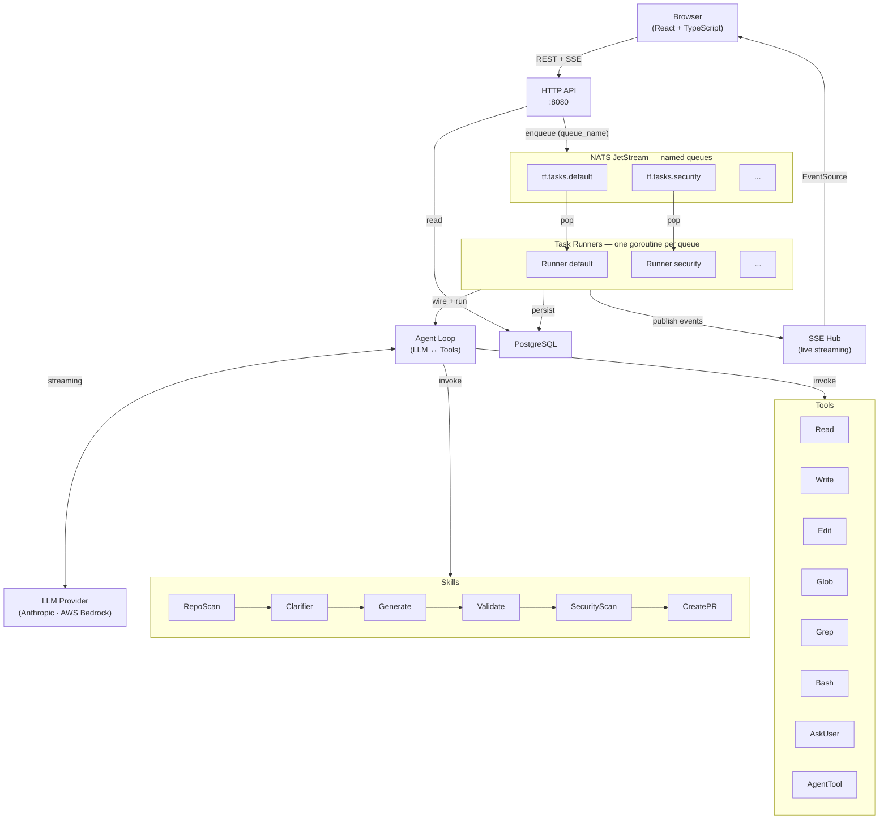
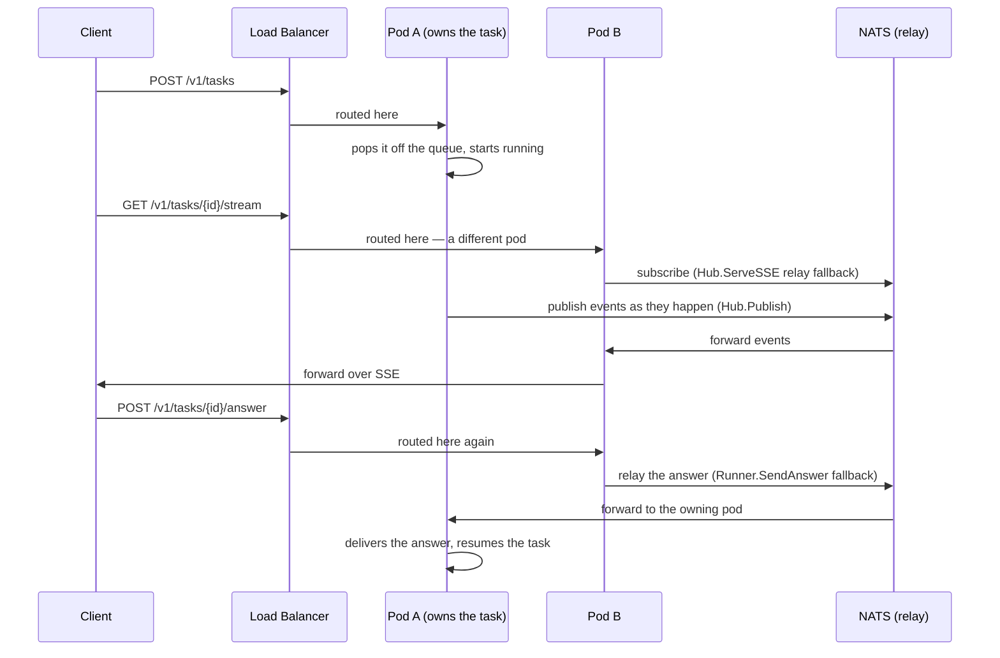

# iac-agent Architecture

## System diagram

## What this is

A single Go binary (`cmd/server`) that accepts a task (a prompt, or a structured
input) over HTTP, runs it through an LLM-driven tool-calling loop
(`internal/agent`), and lets that loop call a fixed set of tools
(`internal/tools`: Read, Write, Edit, Glob, Grep, Ls, Bash, Agent, AskUser,
Task, WebFetch, WebSearch) against a real filesystem/repo. Output is either
printed text or a pull request. A React SPA (`client/`) is embedded into the
binary and served from the same process.

## Request flow

1. `POST /v1/tasks` (`internal/server/handler.go: handleSubmitTask`) validates
   input, creates a `tasks` row (`internal/db`), and pushes the task ID onto a
   queue (`internal/queue`).
2. `internal/server/task_runner.go: Runner` pulls tasks off the queue (respecting
   `llm_concurrency` and `per_user_concurrency` from config), decrypts the
   user's GitHub/Atlassian tokens (`internal/server/crypto.go`), and hands off
   to `internal/agent`.
3. `internal/agent` runs the LLM tool-calling loop (`loop.go`), building the
   system prompt (`prompt.go`) and compacting history when it grows too long
   (`compact.go`). Each tool call is checked against `internal/permissions`
   before it runs (config-driven: `auto` / `ask` / `deny` per tool, see
   `config.sample.toml`'s `[permissions]` block).
4. Tool results and task state stream back to the client over SSE
   (`internal/server/stream.go`, `Hub`), and are persisted incrementally to the
   `tasks` row (`output`, `input_tokens`, `output_tokens`, `status`).
5. `internal/skills` provides higher-level, multi-step flows (RepoScan,
   Clarifier, Generate, Validate, SecurityScan, CreatePR, JiraFetch,
   DriftDetect) that the agent loop can invoke as compound tools.

## Data

PostgreSQL is the only supported store (`internal/db/postgres.go`); an
in-memory implementation (`internal/db/memory.go`) exists solely for unit
tests and is never used in production. Schema changes are versioned SQL files
under `internal/db/migrations/`, applied automatically and idempotently on
every process start (`internal/db/migrate.go`) — see that package for the
exact mechanism. `internal/queue` is in-memory by default, which is safe only
for a single-replica deployment. Any deployment running more than one pod
replica **must** set `queue_driver=nats` (or `QUEUE_DRIVER=nats`): besides the
task queue itself, SSE streaming (`internal/server/stream.go`) and the
answer/permission/cancel control endpoints (`internal/server/task_runner.go`)
are backed by per-process in-memory state and use NATS core pub/sub as a
cross-pod relay (`internal/server/event_relay.go`,
`internal/server/control_relay.go`) — configured automatically whenever
`queue_driver=nats` is set, no separate flag needed. Task rows themselves
were already Postgres-backed and pod-agnostic before this relay existed; this
closes the remaining gap for the control-plane paths. (`make infra` starts
NATS + Postgres locally.)

The sequence this whole mechanism exists for — a client's request landing on a
pod other than the one running its task:

Before this work, the SSE leg above returned a false "task not found" and the
answer leg 409'd — both pods thought they were right. Two details of the
cross-pod SSE path are worth knowing before changing it:

- **A stream reads exactly one source.** `Hub.Publish` writes every event to
  both this pod's local channel and the relay, so reading both would deliver
  everything twice. `Hub.ServeSSE` therefore subscribes to the relay
  immediately (nothing published during the decision window is lost — NATS
  core pub/sub has no replay), then commits to either the local channel or the
  relay and drops the other unread. The local channel is only authoritative
  when this pod actually claimed the task (`Hub.Claim`, called by
  `Runner.run`): a channel also exists on whichever pod merely *accepted* the
  submission, and on that pod it stays empty forever. Because the relay's
  channel is never closed, a relay-only stream also re-reads the task's row
  periodically (`Hub.SetStatusCheck`) so it ends rather than heartbeating
  forever if the terminal event never crosses (lost message, owning pod died).
- **The connect-time snapshot is a point-in-time read.** `InitialSnapshotEvent`
  renders the task's current row so a client landing on a non-owning pod sees
  state immediately. `tasks.pending_kind` records *which* kind of pause a
  `waiting_for_input` row represents (free-text `ask_user` question vs. tool
  permission prompt), so a reconnecting client knows whether to render a text
  box or approve/deny buttons. The snapshot can be marginally stale by the time
  it reaches the client (e.g. the answer landed a moment earlier); that is an
  accepted race — acting on a stale snapshot yields a normal 409, not
  corruption, and the live stream immediately corrects the state.

The NATS work queue itself needed one more fix for correctness under
multiple replicas: every pod that binds to a given queue name shares one
durable JetStream consumer (that's how work fans out across workers), and
`nats.go`'s `Unsubscribe()` auto-deletes a durable consumer if the calling
subscription is the one that created it. Whichever pod happened to start
first against a queue name "owned" it in the library's eyes — its later
*graceful* shutdown (a routine rolling restart, not just a crash) would have
deleted the consumer out from under every other pod still using it, resetting
in-flight delivery tracking and risking the same task running on two pods at
once. `NATSQueue.Close()` no longer calls `Unsubscribe()` — it just closes
the connection, which is all a durable consumer needs to survive a
disconnect. A chaos test (`internal/queue/chaos_test.go`) pins this by
proving an in-flight, unacked delivery does *not* reappear within a short
window after the creating pod's graceful close, but does reappear once the
real `AckWait` elapses.

One trade-off from this work, now closed (see `roadmap.md`): a task whose
NATS delivery exhausts all retry attempts (`MaxDeliver`, currently 5 — a
genuine repeated-crash case) had no automatic path back to a terminal DB
status under `queue_driver=nats`, since the stale-task sweep that used to
(incorrectly) cover this case is skipped there on purpose (running it
unconditionally was itself a correctness bug, see above). This is closed with
an age-based check rather than reinstating the old sweep or hooking into
NATS's per-message delivery-count internals: `db.Store.FailTasksOlderThan`
marks a `running`/`queued`/`waiting_for_input` row failed only once its
`created_at` is older than `stale_task_max_age` (config, default 2 hours —
comfortably above `max_task_duration`'s own 30-minute default, since this is
a backstop for a task that never got a fair shot at running at all, not a
bound on one that's actively running). `cmd/server/main.go` runs it from a
ticker goroutine every 15 minutes, unconditionally under any queue driver:
unlike the old sweep, an age predicate only ever touches rows that have been
non-terminal for an unusually long time — never every non-terminal row right
now — so it can't reproduce the cross-pod false-failure bug, and is safe
under `queue_driver=memory` too.

## Security boundaries

- Every `/v1/*` route requires `Authorization: Bearer <token>`
  (`internal/server/auth.go: authMiddleware`); `/v1/admin/*` routes
  additionally require `adminMiddleware`.
- Tokens are `tfa-` + 40 hex chars; only a SHA-256 hash is stored, the raw
  value is shown once at creation/regeneration time.
- GitHub/Atlassian tokens in `user_settings` are AES-256-GCM encrypted at
  rest and decrypted only inside `task_runner.go` immediately before use.
- Every admin mutation on a user (create, update, delete, activate/deactivate,
  token regenerate/revoke) writes an `audit_events` row recording the acting
  admin, the action, and the target — queryable via
  `GET /v1/admin/audit-log`. Self-action guards prevent an admin from
  deleting, deactivating, or revoking their own account/token.
- `internal/tools` must never import `internal/agent` (import-cycle
  prevention) — cross-package calls go through injected function types (e.g.
  `SubAgentRunner`) wired in `internal/server/task_runner.go`.
- `terraform`/`tflint`/`checkov` (invoked by `ValidateSkill`/
  `SecurityScanSkill`) can optionally run inside a locked-down Docker
  container instead of directly on the host process — see
  `sandbox.md`. Disabled by default (`server.sandbox_enabled = false`);
  when enabled, `internal/sandbox.DockerExecutor` runs them with
  `--network=none`, dropped capabilities, resource limits, and a non-root
  user.

## Enterprise readiness

Capabilities relevant to running this for more than one trusted operator, grouped by what they actually cover today — not a roadmap, only what's shipped.

- **Access control** — admin/member roles enforced by `adminMiddleware`; per-user API keys (`tfa-` + 40 hex chars), only a SHA-256 hash stored server-side, raw value shown once. Tokens can be regenerated or revoked per user without a restart.
- **Audit trail** — every admin mutation on a user (create, update, delete, activate/deactivate, token regenerate/revoke) writes an `audit_events` row with the acting admin, the action, and the target, queryable via `GET /v1/admin/audit-log`. Self-action guards stop an admin from deleting, deactivating, or revoking their own account/token.
- **Secrets at rest** — GitHub and Atlassian tokens in `user_settings` are AES-256-GCM encrypted, decrypted only inside `task_runner.go` immediately before use. Server config secrets (`ANTHROPIC_API_KEY`, `DB_URL`, `TF_AGENT_ADMIN_TOKEN`) are read from environment variables, not the config file — compatible with injection from Kubernetes Secrets, AWS Secrets Manager, or Vault, though none of those are wired in as a native integration.
- **Tenant isolation for tool execution** — `terraform`/`tflint`/`checkov` can run inside a locked-down Docker container or a Kubernetes `Job`, network-isolated (`--network=none` / a deny-all-egress `NetworkPolicy`, both verified enforced — see `sandbox.md`), non-root, resource-limited. Off by default; the default is still direct host execution, appropriate for a single trusted operator.
- **High availability** — N stateless pod replicas behind a plain load balancer, no sticky sessions required, once `queue_driver=nats` is set. SSE streams and answer/permission/cancel requests are correct regardless of which pod a request lands on (see "Data" above).
- **Private / compliant LLM backend** — swap the `anthropic` provider for `bedrock` in config to route through a private VPC with no external rate limits, relevant for HIPAA/SOC2-constrained environments. No code change, config only.
- **Perimeter auth** — every `/v1/*` route requires a bearer token; the server itself has no built-in SSO/SAML/OIDC, so enterprise identity (Okta, Entra ID) is expected to terminate at a reverse proxy in front of it, not inside the app.
- **Observability** — `/healthz` reports LLM concurrency saturation and a task error-rate window; `/metrics` exposes task duration, token usage, prompt cache hit/miss, and per-tool execution counts, scrapeable by Prometheus.

What's explicitly *not* here: no built-in TLS termination (front it with nginx/Caddy/ALB), no native SSO/SAML, no built-in secrets-manager client. These are documented gaps, not oversights — see [roadmap.md](roadmap.md) and the README's Known limitations table.

## Running locally

See `CLAUDE.md` for the up-to-date command list (`make build`, `make dev`,
`make infra`, `make doctor`). This document explains *why* the pieces are
shaped this way; `CLAUDE.md` is the quick-reference for *how* to build and run
them day to day — if the two disagree, trust `CLAUDE.md` for commands and file
an issue to fix this doc. See `sandbox.md` for the terraform/tflint/
checkov execution sandbox specifically, including what's verified working
today and the Kubernetes Job variant's design (not implemented).
