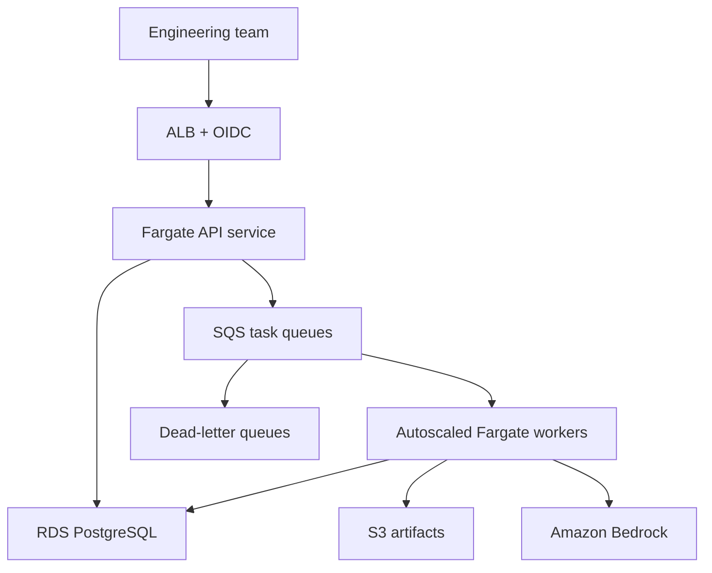

# AWS Production Migration

Phase 2 of the deployment roadmap (see [docs/roadmap.md](roadmap.md)). Once
the on-premises rollout has proven the platform for the pilot team, this
moves the same system to full AWS production by swapping infrastructure
adapters — queue, storage, compute, secrets — without changing agent
behavior: the agent loop, skills, sandbox limits, and checkpoint format stay
identical.

## Target architecture

## On-premises to AWS mapping

| Portable concept | On-premises implementation | AWS production implementation | What remains unchanged |
|---|---|---|---|
| HTTPS routing | Nginx/HAProxy/Traefik | ALB + ACM; optional CloudFront/WAF | API routes, identity claims, request IDs |
| API compute | Existing container platform | Multi-AZ ECS Fargate service | Go server and HTTP/SSE contracts |
| At-least-once task delivery | PostgreSQL leased-task queue | SQS Standard + DLQ | Idempotency, attempts, retries, error classification |
| Isolated execution | Docker/Podman/existing scheduler | Autoscaled Fargate workers | Agent loop, skills, sandbox limits, checkpoints |
| Transactional data | PostgreSQL | RDS PostgreSQL Multi-AZ | Schema, invariants, migrations, authorization |
| Vector memory | PostgreSQL + `pgvector` | RDS PostgreSQL + `pgvector` | Four memory layers, provenance, retrieval filters |
| Durable live events | PostgreSQL `run_events` | RDS PostgreSQL `run_events` | Sequence numbers, retention, SSE replay |
| Artifacts | MinIO/Ceph/NAS adapter | Versioned S3 with lifecycle policies | Content digests, metadata, access policy |
| Images | Harbor/internal registry | ECR | Immutable image digest, signing, SBOM |
| Secrets | Vault/enterprise secret manager | Secrets Manager + KMS | Secret names, rotation contract, audit behavior |
| Human identity | Company OIDC behind proxy | Existing IdP through ALB OIDC or Cognito federation | Application roles and repository scopes |
| Bedrock credentials | IAM Roles Anywhere | ECS task roles | Model allowlist and least-privilege policy |
| Bedrock networking | Controlled egress or VPN/DX + PrivateLink | Bedrock Runtime VPC endpoint | Provider API, retry, timeout, and budget behavior |
| Telemetry | OpenTelemetry + Prometheus/Grafana/log platform | OpenTelemetry + CloudWatch or managed Prometheus/Grafana | Metric names, traces, correlation, SLOs |
| Scheduled repair | Cron/existing scheduler | EventBridge Scheduler + ECS task; optional Lambda | Reconciliation and idempotency algorithms |
| Backups | PostgreSQL backup tooling and storage snapshots | Automated RDS backups/snapshots and S3 protection | Tested restore process and RPO/RTO |
| Autoscaling | Bounded local worker pool | ECS scaling from SQS backlog per worker | Per-user/global concurrency and backpressure |

## Provider boundaries to implement

| Interface | Required operations | Initial adapter | AWS adapter |
|---|---|---|---|
| TaskQueue | Enqueue, claim, renew, complete, retry, dead-letter | PostgreSQL | SQS + DLQ |
| RunStore | Version state, checkpoint, lease/fence, query | PostgreSQL | RDS PostgreSQL |
| EventStore | Append sequence, replay, retain | PostgreSQL | RDS PostgreSQL |
| MemoryStore | Scope, supersede, expire, authorized retrieve | PostgreSQL + pgvector | RDS PostgreSQL + pgvector |
| ArtifactStore | Put/get by digest, access, retention | On-prem object store | S3 |
| Executor | Start, cancel, limit, collect | Local container runtime | ECS Fargate |
| SecretStore | Resolve, version, rotate, audit | Enterprise secret store | Secrets Manager + KMS |
| LLMProvider | Converse/stream, usage, retry classification | Bedrock + Roles Anywhere | Bedrock + task role |

Vendor-specific SDK types must not cross these interfaces. Queue messages
carry identifiers and versions, not complete prompts, credentials, or large
artifacts. Every adapter must pass the same contract, failure-injection, and
security tests.

## Migration sequence

1. Create Terraform modules for VPC, ALB, ECS, SQS/DLQ, RDS, S3, ECR, IAM, KMS, Secrets Manager, and observability.
2. Deploy the existing application using AWS adapters without changing agent behavior.
3. Test SQS duplicate delivery, visibility expiry, DLQ redrive, worker termination, and RDS failover.
4. Rehearse database and artifact migration; measure RPO/RTO.
5. Shadow or replay non-mutating workloads and compare context, diffs, validation, cost, and latency.
6. Cut over gradually with a tested rollback path.
7. Tune workers using SQS backlog, p95 run duration, Bedrock quotas, and cost per successful PR.

## Deferred services

| Service | Decision |
|---|---|
| Lambda | Optional later for a proven short event-driven workload |
| Step Functions | Skip unless deliberately replacing the Go workflow engine |
| EKS | Skip unless the company already standardizes on it |
| Redis/ElastiCache | Skip until a measured coordination/cache requirement exists |
| EFS | Skip; use ephemeral worker storage and durable artifacts |
| OpenSearch | Skip while PostgreSQL full-text search and `pgvector` meet targets |

## Best demonstration

The strongest evidence for this phase is showing that memory, retrieval,
compaction, tools, and sub-agents operate safely inside a fault-tolerant
distributed system — not that AWS products appear in a diagram:

1. Start one Terraform task.
2. Deliver it twice.
3. Kill the active worker after an external Git operation.
4. Restart the API and reconnect the client.
5. Resume from the structured checkpoint.
6. Replay the complete retained event stream.
7. Verify one branch, one PR, correct memory provenance, and successful validation.

## References

- [Amazon Bedrock VPC endpoints](https://docs.aws.amazon.com/bedrock/latest/userguide/vpc-interface-endpoints.html)
- [IAM Roles Anywhere](https://docs.aws.amazon.com/rolesanywhere/latest/userguide/getting-started.html)
- [Amazon Bedrock quotas](https://docs.aws.amazon.com/bedrock/latest/userguide/quotas.html)
- [Bedrock model invocation logging](https://docs.aws.amazon.com/bedrock/latest/userguide/model-invocation-logging.html)
- [SQS visibility timeout and at-least-once delivery](https://docs.aws.amazon.com/AWSSimpleQueueService/latest/SQSDeveloperGuide/sqs-visibility-timeout.html)
- [SQS dead-letter queues](https://docs.aws.amazon.com/AWSSimpleQueueService/latest/SQSDeveloperGuide/sqs-dead-letter-queues.html)
